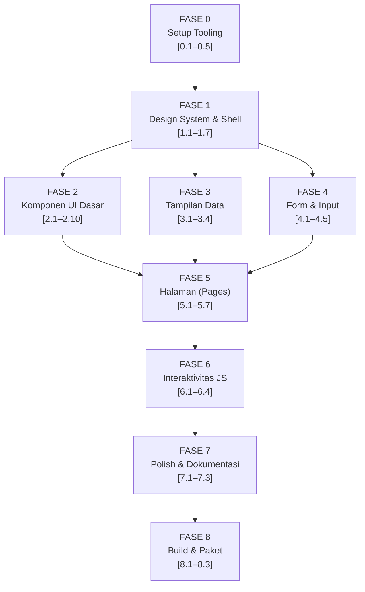

# Analisis & Perencanaan: Admin Template Bootstrap 5

> Dokumen ini adalah hasil analisis dari [RENCANA_ADMIN_TEMPLATE.md](file:///c:/webapps/admin_template/RENCANA_ADMIN_TEMPLATE.md) dan rencana eksekusi terstruktur yang siap dijalankan oleh AI agent.

---

## Ringkasan Proyek

| Item | Detail |
|---|---|
| **Tujuan** | Admin dashboard template open-source berbasis Bootstrap 5, setara Tabler/AdminLTE |
| **Total Task** | ±45 unit task kecil, terbagi 9 fase (Fase 0–8) |
| **Stack Utama** | Bootstrap 5.3.3, Dart Sass, Eleventy 3, esbuild, Tabler Icons, ApexCharts |
| **Bahasa** | Vanilla JS (ES Modules) — tanpa React/Vue/jQuery |
| **Estimasi** | Fase 0–1 fondasi kritis, Fase 2–4 komponen paralel, Fase 5–8 assembly & polish |

---

## Analisis Kekuatan Rencana

### ✅ Yang Sudah Baik
1. **Keputusan terkunci** — versi dependency dikunci eksplisit, menghilangkan ambiguitas
2. **Struktur folder terdefiniasi** — `src/` dan `dist/` dipisah jelas, agent tidak perlu menebak
3. **Definition of Done per task** — kriteria terukur (build pass, responsif 3 breakpoint, dark mode)
4. **Satu sumber kebenaran** — `nav.js` untuk sidebar, tidak ada hardcode di partial
5. **Contoh pola nyata** di Bagian 7 (task [1.7]) — agent bisa meniru 1:1
6. **Urutan eksekusi jelas** — dependency diagram fase eksplisit

### ⚠️ Gap / Risiko yang Perlu Diantisipasi
1. **Tidak ada linting config** — belum ada ESLint / Stylelint; risiko inkonsistensi antar sesi agent
2. **Tidak ada unit test** — perlu playwright/Cypress snapshot minimal untuk regresi layout
3. **Ukuran task bervariasi** — Fase 2 punya 10 sub-task, beberapa sangat ringan, bisa digabung
4. **Chart responsif tidak dibahas** — ApexCharts butuh handling khusus untuk dark mode & resize
5. **Icon shortcode 11ty** — detail implementasi `` belum ada di dokumen
6. **Belum ada CI/CD** — rekomendasi: tambah GitHub Actions untuk `npm run build` otomatis

---

## Peta Dependency Fase (Visual)



---

## Rencana Eksekusi Per Fase

### FASE 0 — Setup & Tooling _(Estimasi: 1 sesi agent)_

| Task | File Utama | Prioritas |
|---|---|---|
| [0.1] Init package.json + install deps | `package.json` | 🔴 Blocker |
| [0.2] Konfigurasi `.eleventy.js` + shortcode `icon` | `.eleventy.js` | 🔴 Blocker |
| [0.3] Pipeline SCSS | `src/scss/app.scss`, npm script | 🔴 Blocker |
| [0.4] Pipeline JS esbuild | `src/js/app.js`, npm script | 🔴 Blocker |
| [0.5] Script `dev` & `build` gabungan | `package.json` | 🔴 Blocker |

> [!IMPORTANT]
> Fase 0 harus **100% selesai** sebelum masuk Fase 1. Kegagalan di sini membuat semua fase berikutnya gagal.

**Detail implementasi shortcode `icon` (gap dari dokumen asli):**
```js
// .eleventy.js — tambahkan ini
const fs = require("fs");
const path = require("path");

eleventyConfig.addShortcode("icon", function(name, opts = {}) {
  const iconPath = path.join(
    __dirname, "node_modules/@tabler/icons/icons", `${name}.svg`
  );
  if (!fs.existsSync(iconPath)) return `<!-- icon ${name} not found -->`;
  let svg = fs.readFileSync(iconPath, "utf-8");
  // inject class jika ada
  if (opts.class) svg = svg.replace("<svg", `<svg class="${opts.class}"`);
  return svg;
});
```

---

### FASE 1 — Design System & Shell _(Estimasi: 2–3 sesi agent)_

> [!CAUTION]
> Fase ini adalah **fondasi paling kritis**. Kesalahan di layout shell ([1.7]) akan merusak SEMUA halaman di fase berikutnya.

| Task | File Utama | Catatan |
|---|---|---|
| [1.1] Variables & Theme SCSS | `_variables.scss`, `_theme.scss` | Semua token dari Bagian 3 |
| [1.2] `base.njk` | `layouts/base.njk` | Load Inter font self-hosted |
| [1.3] `nav.js` | `src/_data/nav.js` | Min. 8 grup menu |
| [1.4] `sidebar.njk` | `partials/sidebar.njk` | Submenu collapse + active highlight |
| [1.5] `navbar.njk` | `partials/navbar.njk` | Toggle sidebar, search, dropdown, dark mode |
| [1.6] `footer.njk` + `page-header.njk` | Dua file partial | Breadcrumb dinamis dari front matter |
| [1.7] `dashboard.njk` | `layouts/dashboard.njk` | Ikuti pola Bagian 7 PERSIS |

**Struktur `nav.js` yang disarankan:**
```js
// src/_data/nav.js
module.exports = [
  { label: "Dashboard", icon: "home", url: "/", badge: null },
  {
    label: "Komponen",
    icon: "components",
    children: [
      { label: "Buttons", url: "/components/buttons/" },
      { label: "Cards", url: "/components/cards/" },
      // dst...
    ]
  },
  // ... 6 grup lagi
];
```

---

### FASE 2 — Komponen UI Dasar _(Estimasi: 3–4 sesi agent)_

> [!NOTE]
> Task 2.1–2.10 bisa dikerjakan **paralel** oleh multiple agent instance, karena tidak saling bergantung. Tiap task menghasilkan 1 file halaman showcase di `pages/components/`.

| Task | Halaman Output | Komponen Kunci |
|---|---|---|
| [2.1] | `buttons.njk` | `.btn-*`, button group, dropdown |
| [2.2] | `alerts.njk` | Alert, toast, badge, ribbon |
| [2.3] | `cards.njk` | Basic card, stat card, card actions |
| [2.4] | `avatars.njk` | Avatar sizes, avatar group, status dot |
| [2.5] | `modals.njk` | Modal sizes, offcanvas positions |
| [2.6] | `navigation.njk` | Tabs, accordion, breadcrumb, pagination |
| [2.7] | `progress.njk` | Progress bar, spinner, skeleton/placeholder |
| [2.8] | `overlays.njk` | Tooltip (Bootstrap), popover |
| [2.9] | `lists.njk` | List group, timeline, stepper |
| [2.10] | `empty.njk` | Empty state (ikon besar + teks + CTA) |

---

### FASE 3 — Tampilan Data _(Estimasi: 2 sesi agent)_

| Task | File | Catatan Teknis |
|---|---|---|
| [3.1] | `tables/basic.njk` | Semua varian tabel Bootstrap |
| [3.2] | `tables/interactive.njk` + `datatable.js` | Sort, search, pagination — pure Vanilla JS |
| [3.3] | `charts/index.njk` + `charts.js` | ApexCharts: line, area, bar, donut, sparkline |
| [3.4] | (bagian dari `index.njk`) | Stat cards dengan mini-chart ApexCharts |

> [!TIP]
> Untuk **ApexCharts dark mode**, gunakan event listener pada mutasi atribut `data-bs-theme` di `<html>`:
> ```js
> const observer = new MutationObserver(() => {
>   const dark = document.documentElement.dataset.bsTheme === "dark";
>   chart.updateOptions({ theme: { mode: dark ? "dark" : "light" } });
> });
> observer.observe(document.documentElement, { attributes: true });
> ```

---

### FASE 4 — Form & Input _(Estimasi: 2 sesi agent)_

| Task | File | Catatan |
|---|---|---|
| [4.1] | `forms/inputs.njk` | Semua input dasar + input group |
| [4.2] | `forms/controls.njk` | Checkbox, radio, switch, range, color |
| [4.3] | `forms/validation.njk` | State valid/invalid, feedback message |
| [4.4] | `forms/upload.njk` | Dropzone styling + drag-drop JS opsional |
| [4.5] | `forms/layout.njk` | Form horizontal + multi-step wizard |

---

### FASE 5 — Halaman (Pages) _(Estimasi: 3–4 sesi agent)_

| Task | File | Layout |
|---|---|---|
| [5.1] | `index.njk` | dashboard (stat + chart + tabel) |
| [5.2] | `dashboard-analytics.njk` | dashboard (chart-dense) |
| [5.3] | `auth/login.njk`, `register.njk`, dll | layout auth minimal |
| [5.4] | `errors/404.njk`, `500.njk`, `maintenance.njk` | layout minimal |
| [5.5] | `profile.njk`, `settings.njk` | dashboard + tabs |
| [5.6] | `users/list.njk`, `users/detail.njk`, `users/form.njk` | dashboard + CRUD |
| [5.7] | `icons.njk`, `blank.njk` | dashboard |

> [!IMPORTANT]
> Layout **auth** dan **error** harus dibuat terpisah dari `dashboard.njk` — buat `layouts/auth.njk` yang extend `base.njk` tanpa sidebar.

---

### FASE 6 — Interaktivitas JS _(Mengikuti task terkait)_

| Modul | File | Fitur |
|---|---|---|
| `theme.js` | [6.1] | Toggle dark/light, persistensi localStorage |
| `sidebar.js` | [6.2] | Collapse/expand, state localStorage, auto-collapse mobile |
| `datatable.js` | [6.3] | Sort by kolom, search realtime, paginate |
| `charts.js` | [6.3] | Init ApexCharts, dark mode sync |
| `app.js` | [6.4] | Bootstrap tooltip/popover init, import semua modul |

---

### FASE 7 — Polish & Dokumentasi _(Estimasi: 1 sesi agent)_

- **[7.1]** Audit dark mode: buka setiap halaman → toggle → cek kontras (min WCAG AA)
- **[7.2]** Audit responsif: DevTools 375px → 768px → 1440px di semua halaman
- **[7.3]** Tulis `README.md` komprehensif

---

### FASE 8 — Build & Paket _(Estimasi: 1 sesi agent)_

- **[8.1]** Produksi: `--minify` CSS + JS, hapus source map
- **[8.2]** Verifikasi `dist/` dengan file-server lokal
- **[8.3]** MIT license + cleanup file

---

## Checklist QA Akhir

- [ ] Semua halaman Fase 5 ada dan bisa dibuka
- [ ] Semua komponen Fase 2–4 punya halaman showcase
- [ ] Dark mode konsisten di semua halaman
- [ ] Responsif 375 / 768 / 1440px tanpa overflow
- [ ] Menu sidebar hanya dari `nav.js`
- [ ] `npm run build` bersih, `dist/` bisa dibuka langsung
- [ ] Tidak ada dependency di luar yang dikunci
- [ ] README menjelaskan cara pakai & cara menambah halaman
- [ ] Lisensi MIT terpasang
- [ ] ApexCharts sync dengan dark mode toggle
- [ ] Icon shortcode berfungsi di semua halaman

---

## Rekomendasi Tambahan (di luar dokumen asli)

### 1. Tambah Linting Config
```json
// .eslintrc.json (minimal)
{ "env": { "browser": true, "es2022": true }, "rules": { "no-unused-vars": "warn" } }
```

### 2. Tambah `.gitignore`
```
node_modules/
dist/
.cache/
```

### 3. Tambah GitHub Actions CI
```yaml
# .github/workflows/build.yml
name: Build Check
on: [push, pull_request]
jobs:
  build:
    runs-on: ubuntu-latest
    steps:
      - uses: actions/checkout@v4
      - uses: actions/setup-node@v4
        with: { node-version: '20' }
      - run: npm ci
      - run: npm run build
```

---

## Rekomendasi Agentic AI Skills

> Daftar skill AI yang paling relevan untuk mempercepat eksekusi proyek ini.

### 🏆 TIER 1 — Kritis (Langsung Manfaat Besar)

#### 1. `scaffold-project` Skill
- **Fungsi:** Generate struktur folder + file placeholder sesuai spec dalam satu eksekusi
- **Dipakai di:** Fase 0, Task [0.1]
- **Manfaat:** Menghilangkan human error copy-paste struktur folder
- **Trigger:** "buat struktur folder sesuai spec Bagian 2"

#### 2. `component-generator` Skill
- **Fungsi:** Generate halaman showcase komponen Nunjucks dari template standar
- **Dipakai di:** Fase 2 (semua 10 task), Fase 4
- **Manfaat:** Fase 2 adalah 10 task repetitif dengan pola sama — skill ini bisa parallelisasi
- **Input:** nama komponen + daftar varian → output: file `.njk` lengkap

#### 3. `scss-design-token` Skill
- **Fungsi:** Mengkonversi design token (warna, spacing, radius) ke format SCSS variables
- **Dipakai di:** Fase 1, Task [1.1]
- **Manfaat:** Konsistensi token antar proyek, bisa reuse untuk turunan template

#### 4. `dark-mode-auditor` Skill
- **Fungsi:** Scan semua file `.njk` → check apakah semua elemen custom menggunakan CSS variable Bootstrap (bukan hardcode color)
- **Dipakai di:** Fase 7, Task [7.1]
- **Output:** laporan elemen yang berpotensi rusak saat dark mode aktif

---

### 🥈 TIER 2 — Sangat Berguna

#### 5. `responsive-checker` Skill
- **Fungsi:** Jalankan Playwright headless → screenshot halaman di 375/768/1440px → deteksi overflow
- **Dipakai di:** Fase 7, Task [7.2]
- **Output:** carousel screenshot per halaman + laporan issue

#### 6. `nunjucks-partial-generator` Skill
- **Fungsi:** Generate partial Nunjucks (sidebar, navbar) dari definisi data `nav.js`
- **Dipakai di:** Fase 1, Task [1.4] dan [1.5]
- **Manfaat:** Agent tidak perlu menulis HTML sidebar manual — generate dari struktur data

#### 7. `icon-catalog-builder` Skill
- **Fungsi:** Scan folder `@tabler/icons` → generate halaman `icons.njk` otomatis
- **Dipakai di:** Fase 5, Task [5.7]
- **Output:** Grid semua ikon tersedia + nama + kode shortcode

#### 8. `apexcharts-config-generator` Skill
- **Fungsi:** Generate konfigurasi ApexCharts (theme-aware) dari deskripsi chart
- **Dipakai di:** Fase 3, Task [3.3]
- **Input:** "buat line chart dengan data dummy 7 hari, dark-mode aware"
- **Output:** config JS siap pakai

---

### 🥉 TIER 3 — Pendukung

#### 9. `npm-script-composer` Skill
- **Fungsi:** Bantu compose `package.json` scripts dengan `npm-run-all` untuk watch paralel
- **Dipakai di:** Fase 0, Task [0.5]

#### 10. `readme-generator` Skill
- **Fungsi:** Generate `README.md` komprehensif dari struktur folder + package.json
- **Dipakai di:** Fase 7, Task [7.3]

#### 11. `eleventy-config-helper` Skill
- **Fungsi:** Template `.eleventy.js` dengan passthrough, shortcode, filter siap pakai
- **Dipakai di:** Fase 0, Task [0.2]

#### 12. `crud-page-generator` Skill
- **Fungsi:** Generate trio halaman CRUD (list + detail + form) dari definisi entity
- **Dipakai di:** Fase 5, Task [5.6]
- **Input:** definisi entity `User { name, email, role, status }`
- **Output:** `user-list.njk`, `user-detail.njk`, `user-form.njk`

---

### 💡 Skill Lanjutan (Opsional tapi Powerful)

#### 13. `visual-regression-tester` Skill
- **Fungsi:** Screenshot baseline → compare setelah perubahan → highlight diff piksel
- **Relevan untuk:** menjaga konsistensi komponen antar sesi agent berbeda

#### 14. `accessibility-auditor` Skill
- **Fungsi:** Scan HTML output → check ARIA roles, label, kontras warna (WCAG AA)
- **Relevan untuk:** Fase 7, polish sebelum release

#### 15. `changelog-generator` Skill
- **Fungsi:** Generate `CHANGELOG.md` dari commit history + task yang selesai
- **Relevan untuk:** Fase 8, dokumentasi rilis

---

## Strategi Eksekusi dengan AI Agent

### Rekomendasi Pendekatan

```
Sesi 1: Fase 0 (semua task) → validasi: npm run dev berjalan
Sesi 2: Fase 1 [1.1–1.3] → validasi: SCSS compile, nav.js ada
Sesi 3: Fase 1 [1.4–1.7] → validasi: layout dashboard tampil
Sesi 4–6: Fase 2 (task 2.1–2.10, bisa paralel 2-3 task/sesi)
Sesi 7: Fase 3 + Fase 4 (bergantian)
Sesi 8–9: Fase 5 (halaman lengkap)
Sesi 10: Fase 6 (semua modul JS)
Sesi 11: Fase 7 (polish)
Sesi 12: Fase 8 (build final)
```

> [!TIP]
> Gunakan `/goal` slash command untuk sesi yang panjang (Fase 2) agar agent berjalan sampai semua task fase selesai tanpa perlu diinterupsi.

### Cara Memberi Task ke Agent
Selalu sertakan:
1. Nomor task spesifik (mis. "[2.3] Cards")
2. Referensi ke pola di Bagian 7 dokumen asli
3. Kriteria "Done when" dari task tersebut

**Contoh prompt yang baik:**
```
Kerjakan task [2.3] Cards dari RENCANA_ADMIN_TEMPLATE.md.
Buat file src/pages/components/cards.njk menggunakan layout dashboard.njk.
Tampilkan: basic card, card dengan header+footer, stat card (angka+ikon), card dengan action button.
Done when: halaman bisa dibuka, card tampil benar di light & dark mode, npm run build pass.
```

---

*Dokumen ini dibuat: 2026-07-23 | Berdasarkan: RENCANA_ADMIN_TEMPLATE.md*
